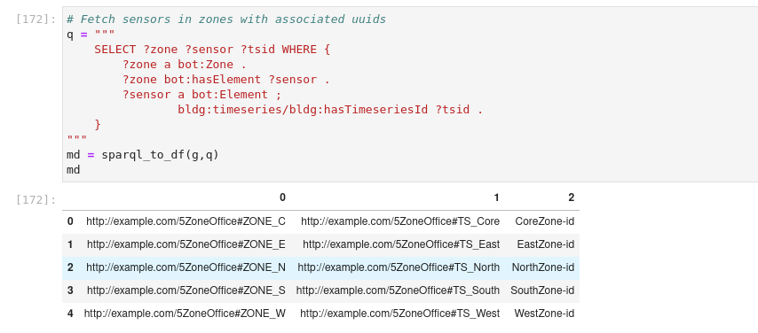
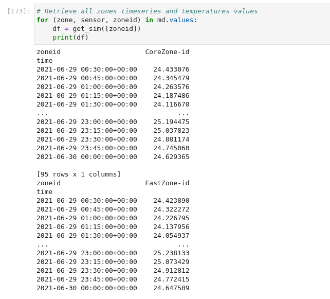
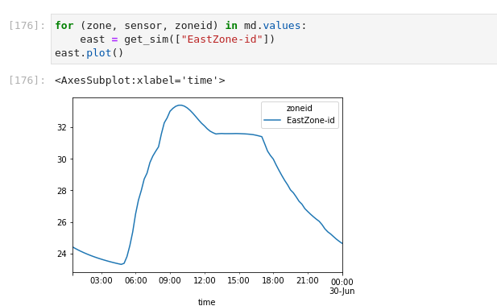
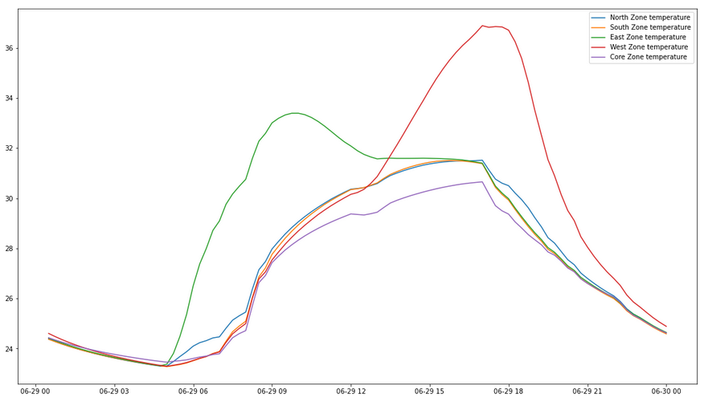

# E+ timeseries to timescaleDB

Time series in [EnergyPlus](https://energyplus.net/) facilitate data exchange of simulation outputs. However, file-based approaches
hinder integration of BPS/AECO data. This is reflected in the inhability of sim outputs to be retrieved by stakeholders 
during different stages of a project. Semantic Web Technology (SWT) is gainining traction in the AECO for increasing data interoperability.
SWT permit the creation of linked-data models over the web (under W3C standard RDF, OWL, SPARQL, SKOS) facilitating data integration of disperse data sources.

BPS community can take advantage of SWT and look for more efficient approaches to exchange/transfer BPS data among different AECO parties.
In other words,with the use of linked building representations (semantic models), BPS outputs can be retrieved by the involved actors during different stages
of a project. 

This repo is based on [brick's data retrieval demo](https://github.com/gtfierro/brick-data-retrieval-demo) by [gtfierro](https://github.com/gtfierro);
which uses BMS points data, [brickschema](https://brickschema.org/) and jupyter/timescaledb docker images.

In this example:

* An [EnergyPlus](https://energyplus.net/) model of an single storey
office with 5 HVAC zones is simulated to report every zone temperature during the hottest day of the
year. 
* An ``Output:Variable`` object report the timeseries corresponding to the temperatures of every zone in the model.
* Timeseries data allocated in .csv file is then post-process to report time, zone temperature and an id corresponding to the simulated zone.
* Then a semantic representation of the office is created using [bot](https://w3c-lbd-cg.github.io/bot/) schema for describing the office topology 
* Timeseries ids corresponding to .csv files are mapped into the semantic model (bot model). 
* Time series data is loaded to timescaledb
* Semantic model and its relationships to timeseries data  are discovered, arrange and plotted. 


More info on the energy model can be found on e+ "./ExampleFiles/BasicFiles/exercise2.idf" and
on the ["Getting Started"](https://energyplus.net/sites/default/files/pdfs_v8.3.0/GettingStarted.pdf) guide.

To set up repo and access to the detailed example , first start docker containers:

```
# start docker containers
./scripts/start_docker_containers.sh
```

Then load energyplus timseries data 

```
# load energyplus timeseries data
./scripts/setup.sh
```

Once configured, you should be able to start the example locally and:

Performe queries


Retrieve timeseries data from zones

 
Access and plot timeseries data of each available zone 


Plot and compare data from all zones of the building model




 
